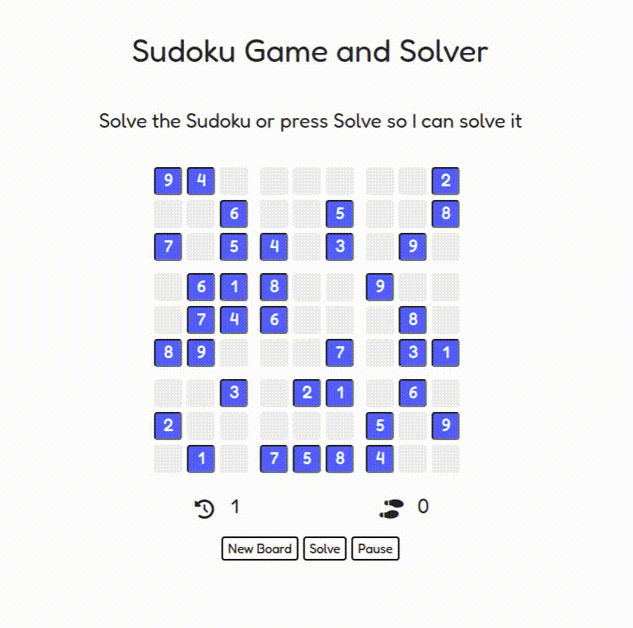
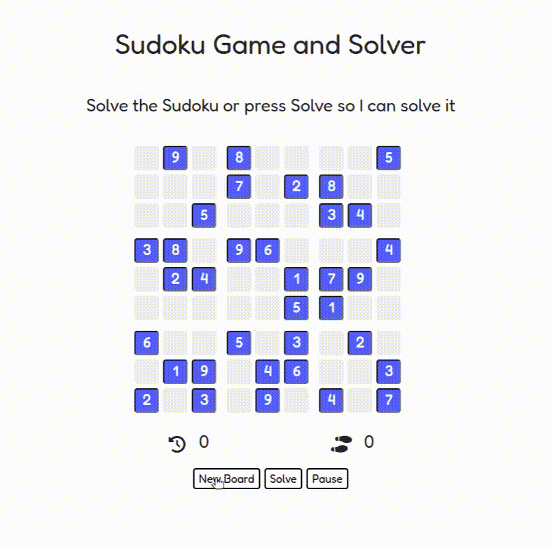
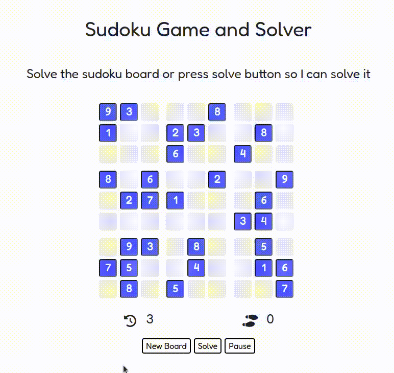

# Sudoku Solver and Game
Solves any sudoku puzzle using backtracking algorithm while visualizing the whole process. It's a web application made using Django.

It contains a **million** different puzzles to be solved by you or the computer.

Sudoku is a 9x9 puzzle game where you solve a puzzle by inputting digits (1-9) in empty spaces until the entire grid is filled and that multiple of the same number are not in the same row, column, or box. [Visit app](https://sudokusolverandgame.herokuapp.com)
  
## Setup
 

 First **install** all required modules using following command:

`pip install -r requirements.txt `

Make sure you have *sudoku.csv* file in _main/static_. If you face any issues with the csv file, then you can download it from here:

<a href="https://www.kaggle.com/bryanpark/sudoku">*One Million Sudoku Puzzles*</a>

Then **run** the project by following command:

`python manage.py runserver`

*or*

`python3 manage.py runserver`

If the migrations aren't being applied, then simply run the following command:

`python manage.py migrate`

*or*

`python3 manage.py migrate`

and then re-run previous command.
  
## Features
 

- One million different sudoku puzzles with various difficulties
- Marks whether every move is correct or incorrect
- Animates the backtracking process with variety of animation speeds to choose from
  
## Demonstration
 

<h3>Sudoku Solver Visualization</h3>

  
<h3>Gameplay</h3>

  
<h3>More Showcase</h3>
